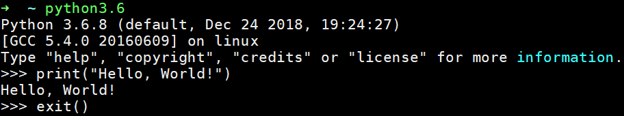
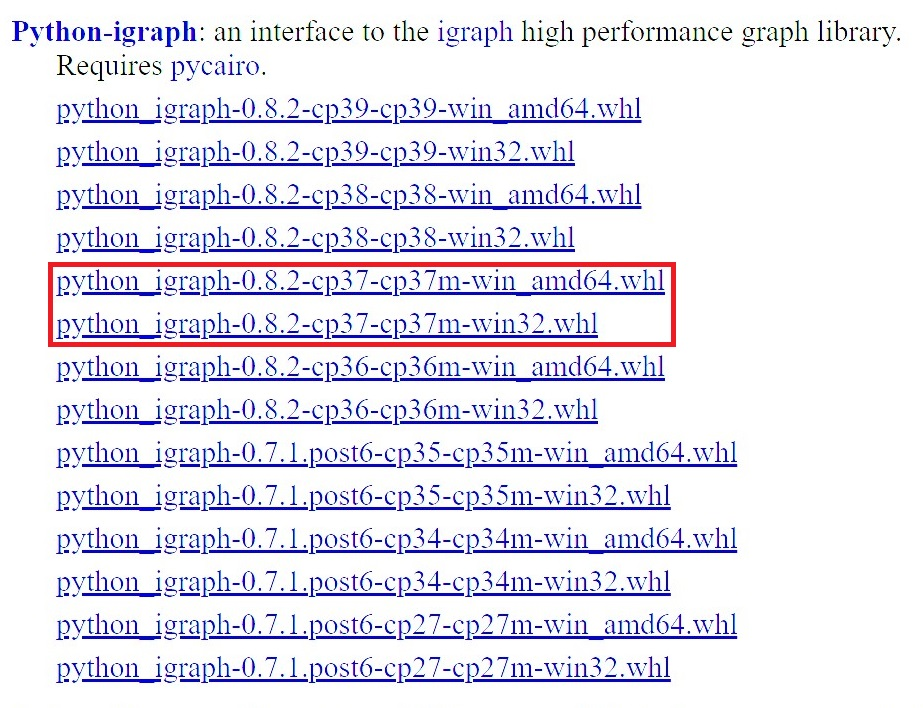
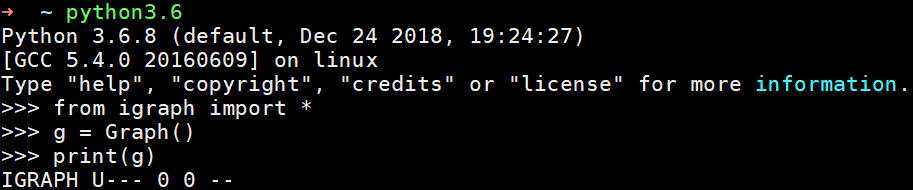

# Python 3 + iGraph Install Tutorial

Network Science COM 530500

TA: Ping-En Lu

## Introduction

[Python is a dynamic, interpreted (bytecode-compiled) language. There are no type declarations of variables, parameters, functions, or methods in source code. This makes the code short and flexible, and you lose the compile-time type checking of the source code. Python tracks the types of all values at runtime and flags code that does not make sense as it runs.](https://developers.google.com/edu/python/introduction) Moreover, Python is useful for a range of application types, including Web development, scientific computing, and education.

Python-iGraph is a Python module that provides collection of network analysis tools with the emphasis on efficiency, portability and ease of use.

## How to install Python 3 in many platforms

### Debian/Ubuntu

```sh
sudo apt-get update
sudo apt-get upgrade
sudo apt-get install build-essential
sudo apt-get install python3
sudo apt-get install python3-dev
```

---

### macOS

Assuming you have Homebrew installed. If not, please install [Homebrew](https://brew.sh/) first.

#### Install Homebrew

```bash
/usr/bin/ruby -e "$(curl -fsSL https://raw.githubusercontent.com/Homebrew/install/master/install)"
```

#### Install Python 3 on macOS

```bash
brew install python3
```

---

### Windows

Download executable installer from the [Python official site](https://www.python.org/downloads/release/python-379/).

- 64-bit: Windows x86-64 executable installer
- 32-bit: Windows x86 executable installer

Be sure to check the box that says **Add Python 3.x to PATH**.

---

### Python 3 Hello, World!

```bash
python3
```

```python 3
print("Hello, World!")

exit()
```



---

## How to install Python-iGraph

Guide from the [Python-iGraph](https://igraph.org/python/#pyinstall) official site.

### Debian/Ubuntu

```sh
sudo -H pip3 install python-igraph
```

If the above command is not working, then type the commmand below and try it again.

```sh
sudo apt-get install libxml2-dev zlib1g-dev -y
```

### macOS

```bash
sudo -H pip3 install python-igraph
```

Instead of letting pip compile the C core for you, you can install Homebrew and the homebrew/science/igraph formula. This will ensure that the C core is found by pip so running pip install python-igraph will compile the Python interface only and link it to the C core.

If the above command is not working, then install **Xcode** at the App Store first. Also, run the command below and try it again.

```bash
xcode-select --install
```

### Windows

Download one of the unofficial installers built by [Christoph Gohlke](https://www.lfd.uci.edu/~gohlke/pythonlibs/#python-igraph).
*Note that the automatic compilation of the C core when running __pip install python-igraph might not work on Windows!__* However, you still can try __pip install python-igraph__ since the new version (version above 0.8) of python-igraph has handled the issue above.


```powershell
pip3 install python_igraph‑0.8.2‑cp37‑cp37m‑win_amd64.whl
```

### Plot the Graph by python-igraph

igraph uses the Cairo library for plotting, so you will need Cairo and its Python interface.

For Debian and Debian derivatives including Ubuntu:

```sh
sudo apt-get install libcairo2-dev
sudo pip install cairocffi
```

For macOS:

```bash
brew install cairo
brew install py3cairo
sudo pip install cairocffi
```

For Windows:
Please download gtk2-runtime and gtk3-runtime from [GTK-for-Windows-Runtime-Environment-Installer](https://github.com/tschoonj/GTK-for-Windows-Runtime-Environment-Installer/releases) and install it.

### Python-iGraph Hello, World!

```bash
python3
```

```python 3
from igraph import *

g = Graph()
print(g)
```



---

## Some other Python Packages for Network Analysis and Scientific Computing

Installation command for Python packages.

```bash
sudo -H pip3 install package_name
```

### Python Packages for Scientific Computing

- Numpy
- Scipy
- Pandas

### Python Packages for Plotting

- Matplotlib
- Seaborn

### Python Packages for network analysis

- Python-iGrpah
- NetworkX

### Python Packages for Interactive Computing

- Jupyter
- IPython
- Spyder 3

## A Good Code Editor for Python

- [Visual Studio Code](https://code.visualstudio.com/)
- [Spyder 3](https://www.spyder-ide.org/)
- [Sublime text 3](https://www.sublimetext.com/)
